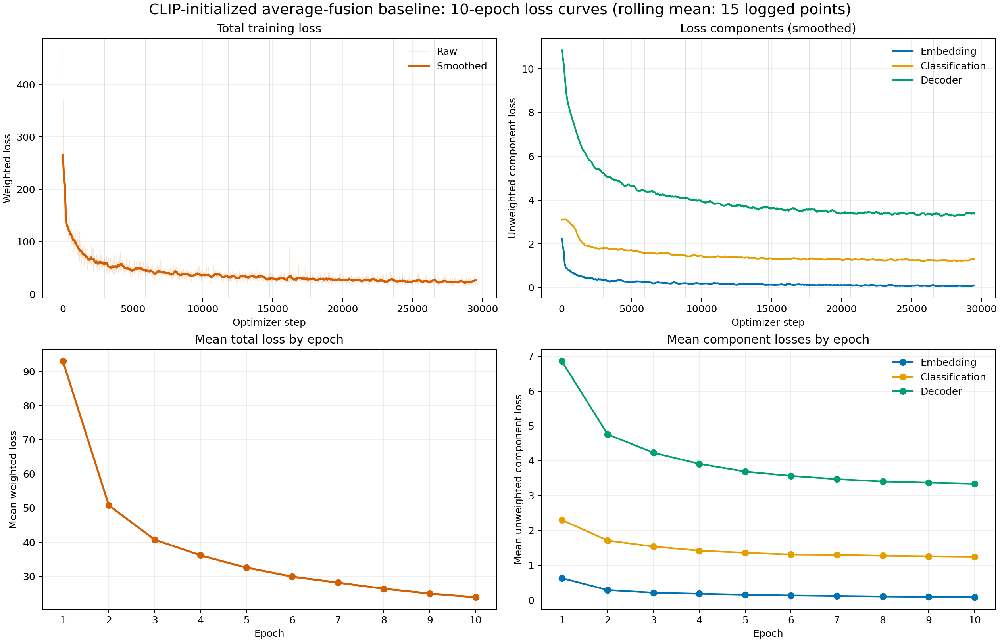

# Image Retrieval with Text and Sketch

This project investigates image retrieval with complementary text and sketch queries on COCO 2014. It studies how multimodal fusion and sketch augmentation affect sketch-only, text-only, and mixed-query retrieval, with particular attention to the synthetic-to-human sketch domain gap. The implementation builds on the TASK-former approach introduced in the ECCV 2022 paper [*A Sketch Is Worth a Thousand Words: Image Retrieval with Text and Sketch*](https://patsorn.me/projects/tsbir/).

## Baseline reproduction

The baseline uses CLIP ViT-B/16 initialization, shared image-sketch encoder weights, and fixed average fusion. Evaluation uses the 5,000-image COCO test gallery with human sketches. Recall and MRR are reported as percentages.


| Query  |   R@1 |   R@5 |  R@10 |   MRR |
| ------ | ----: | ----: | ----: | ----: |
| Sketch | 12.60 | 24.38 | 31.66 | 18.98 |
| Text   | 43.63 | 72.26 | 81.92 | 56.60 |
| Mixed  | 49.27 | 75.86 | 85.07 | 61.26 |

### Baseline training loss



## Optimization

Four changes were evaluated to improve fusion or reduce the synthetic-to-human sketch domain gap:

1. **Joint Gate:** replace fixed average fusion with a query-dependent learned text/sketch weight and train it together with the encoders.
2. **Frozen reliability Gate:** freeze the baseline encoders and train only a Gate using retrieval and reliability supervision.
3. **Segment dropout:** remove connected stroke segments instead of individual pixels to create structured sketch corruption.
4. **C2 human-style consistency:** combine line-width, gap, simplification, deformation, and structural perturbations with dual-view feature consistency.

The Gate variants and segment dropout did not improve retrieval on human sketches. C2 was selected as the final optimization because it was the only method that consistently improved the human-sketch domain. Full ablation results are documented in [report/optimization_experiments.md](report/optimization_experiments.md).

## Optimized results

The table reports the final C2 result and its absolute change from the baseline.


| Query  |       R@1 |       R@5 |      R@10 | Change from baseline (R@1 / R@5 / R@10) |
| ------ | --------: | --------: | --------: | --------------------------------------: |
| Sketch | **14.08** | **26.64** | **33.26** |                   +1.48 / +2.26 / +1.60 |
| Text   | **43.69** | **72.62** | **82.22** |                   +0.06 / +0.36 / +0.30 |
| Mixed  | **50.46** | **76.60** | **85.21** |                   +1.19 / +0.74 / +0.14 |

## Training records

The five formal training records are stored under [`report/training_runs/`](report/training_runs/):

- [`01_baseline_avg`](report/training_runs/01_baseline_avg/)
- [`02_joint_gate`](report/training_runs/02_joint_gate/)
- [`03_frozen_reliability_gate`](report/training_runs/03_frozen_reliability_gate/)
- [`04_segment_dropout`](report/training_runs/04_segment_dropout/)
- [`05_c2_human_style_consistency`](report/training_runs/05_c2_human_style_consistency/)

Each directory contains `config.yaml`, `training.log`, `train.csv`, `epoch_summary.csv`, and `loss_curves.png`. Smoke tests and aborted runs are excluded.

## Model weights

The five final checkpoints are available from the [ModelScope model repository](https://www.modelscope.cn/models/tmq244/image-retrieval-text-sketch).

## Repository layout

```text
code/clip/   Modified CLIP/TASK-former model
configs/     Training configurations
src/tsbir/   Data, training, and evaluation code
scripts/     Download, launch, analysis, and plotting tools
tests/       Augmentation tests
report/      Final report, technical notes, and training records
```

Large datasets, checkpoints, and evaluation outputs are stored in the Git-ignored `data/`, `model/`, and `outputs/` directories.

## Setup

The tested environment uses Python 3.10, PyTorch 2.5.1, torchvision 0.20.1, and CUDA 12.1.

```bash
conda env create -f environment.yml
conda activate tsbir
export PYTHONPATH="$PWD/src:$PWD/code"
```

Download the data and prepare the COCO manifests:

```bash
bash scripts/download_coco.sh data
bash scripts/download_photosketch.sh

CUDA_VISIBLE_DEVICES=0 python -m tsbir.generate_sketches \
  --input data/coco/train2014 \
  --input data/coco/val2014 \
  --output data/synthetic_sketches \
  --batch-size 128 \
  --workers 8

python -m tsbir.prepare_data --root data
```

## Training

Train the 10-epoch baseline on two GPUs:

```bash
CUDA_VISIBLE_DEVICES=0,1 torchrun --standalone --nproc-per-node=2 \
  -m tsbir.train \
  --config configs/train_coco_clip_10ep_gpu12.yaml
```

Train the C2 human-style consistency model:

```bash
CUDA_VISIBLE_DEVICES=0,1 torchrun --standalone --nproc-per-node=2 \
  -m tsbir.train \
  --config configs/train_coco_clip_humanstyle_consistency_10ep_auto2gpu.yaml
```

Other experiments are defined in `configs/`; repository-relative launcher scripts are provided in `scripts/`.

## Evaluation

```bash
CUDA_VISIBLE_DEVICES=0 python -m tsbir.evaluate \
  --checkpoint outputs/taskformer_coco_clip_10ep_gpu12_bs96/last_weights.pt \
  --manifest data/processed/manifests/test.jsonl \
  --output outputs/test_clip_10ep_gpu12_last
```

Each evaluation produces retrieval metrics, Top-5 predictions, and rendered success/failure cases.

## Tests

```bash
PYTHONPATH=src:code pytest -q
```

## Report

See [report/README.md](report/README.md) for the final PDF report and supporting technical notes. The original 100-image demo remains available at [notebooks/Retrieval_Demo.ipynb](notebooks/Retrieval_Demo.ipynb).
